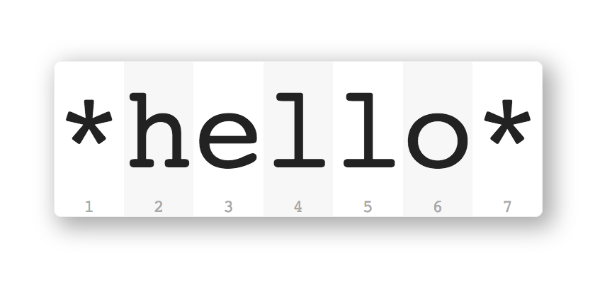

# [large-type.com](http://large-type.com) – Display and share text in a large font, directly from your browser

Large-type.com is a utility website that lets you **display & share text in a very large font** directly from your browser.

That's handy whenever you need to **read something on your screen from further away**—for example, phone numbers and passwords.

Even better, when you share text with large-type.com **only the person with the link sees your text**. Rendering happens locally on your browser and your text is not transmitted to any servers.

Here's a quick [demo video](https://www.youtube.com/watch?v=EHaH3dO1YH4).

## FAQs

### What can I use it for?
Here are some ideas:

* Read that phone number from across the room?
    * [large-type.com/#(555)-123-456](http://large-type.com/#(555)-123-456)
* Co-worker needs to know your IP address?
    * [large-type.com/#192.168.1.23](http://large-type.com/#192.168.1.23)
* Show your friend the WiFi password?
    * [large-type.com/#P4$$w0rd](http://large-type.com/#P4%24%24w0rd)
* Important announcement on social media?
    * [large-type.com/##YOLO](http://large-type.com/#%23YOLO)
* Need a giant timer notification?
    * `$ sleep 10; open http://large-type.com/#Done!`
* Waiting for your code to compile?
    * `$ make; open http://large-type.com/#Done!`
* Embed it in your own apps?
    * `'http://large-type.com/#' + encodeURIComponent('Your Text Here')`
* Profess your love from a runaway train?
    * [large-type.com/#I❤U](http://large-type.com/#I❤U)

### How secure is it?

**The short answer**: Sharing text with someone by sending them a link to large-type.com offers the same level of security as sending them the text directly. Always use secure communication methods when sharing password URLs.

**The long answer**: When you share a link to large-type.com with someone and they open it in their browser, the text in the URL fragment won't be transmitted as part of the HTTP request. As per [RFC 2396](https://tools.ietf.org/html/rfc2396#section-4) browsers [don't send the URL fragment with the HTTP request](https://stackoverflow.com/questions/317760/how-to-get-url-hash-from-server-side).

> When a URI reference is used to perform a retrieval action on the identified resource, the optional fragment identifier, separated from the URI by a crosshatch ("#") character, consists of additional reference information **to be interpreted by the user agent after the retrieval action has been successfully completed**. As such, it is not part of a URI, but is often used in conjunction with a URI. (RFC 2396 section 4.1)

Large-type.com uses Google Analytics and Twitter widgets. Both do not report URL fragments to their backend servers.

All text formatting and rendering happen locally on your browser through CSS and JavaScript. Your text is not transmitted to any servers when the browser.

Additionally, large-type.com is fully open-source, small and hosted on GitHub Pages which means you can audit the source code to see that your data isn't sent or stored anywhere else.

Please keep in mind that, while large-type does not send the text to a backend server, large-type.com is not responsible for how you choose to share the URL. Please use secure communication methods when sharing password URLs.

### I found a bug! Now what?
Awesome! Please [create an issue](https://github.com/dbader/large-type.com/issues) on GitHub (and if you have a really good day maybe a pull request, too 😃) so we can fix it. Thanks!

## Meta
Design inspired by [1Password's](https://agilebits.com/onepassword) large-type feature.

Daniel Bader – [@dbader_org](https://twitter.com/dbader_org) – mail@dbader.org

[https://github.com/dbader/large-type.com](https://github.com/dbader/large-type.com)
